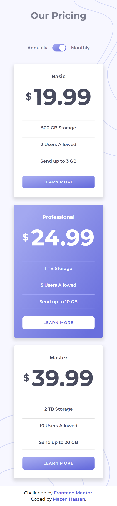

# Frontend Mentor - Pricing component with toggle solution

This is a solution to the [Pricing component with toggle challenge on Frontend Mentor](https://www.frontendmentor.io/challenges/pricing-component-with-toggle-8vPwRMIC). Frontend Mentor challenges help you improve your coding skills by building realistic projects.

## Table of contents

- [Frontend Mentor - Pricing component with toggle solution](#frontend-mentor---pricing-component-with-toggle-solution)
  - [Table of contents](#table-of-contents)
  - [Overview](#overview)
    - [The challenge](#the-challenge)
    - [Screenshot](#screenshot)
    - [Links](#links)
    - [Built with](#built-with)
    - [What I learned](#what-i-learned)
    - [Continued development](#continued-development)
    - [Useful resources](#useful-resources)
  - [Author](#author)
  - [Acknowledgments](#acknowledgments)

## Overview

### The challenge

Users should be able to:

- View the optimal layout for the component depending on their device's screen size
- Control the toggle with both their mouse/trackpad and their keyboard
- **Bonus**: Complete the challenge with just HTML and CSS

### Screenshot




### Links

- Solution URL: [solution URL](https://your-solution-url.com)
- Live Site URL: [live site URL](https://pricing-component-with-toggle-beryl-five.vercel.app/)

### Built with

- Semantic HTML5 markup
- CSS custom properties
- Flexbox
- CSS Grid
- Mobile-first workflow
- [React](https://reactjs.org/) - JS library
- [Tailwind CSS](https://tailwindcss.com/docs/installation) - CSS framework

### What I learned

In this challenge I have learned to implement accessible switch toggle using radio buttons for choosing between 2 options, steps I followed to achieve is:

- Creating a correct html structure with associated labels.
- Wrapping input elements in a parent with 2 additional spans for styling switch toggle.
- Utilizing toggle functionality by making input `z-index` rest on top of switch visual and with opacity set to 0 we get a fully custom switch toggle visual that transition for both options.

leared subsequent combinator in CSS which is `peer` in tailwind:

- I learned the subsequent sibling combinator for matching the target element anywhere inside the same parent.
- In tailwind it's called `peer` so I used it for both input and referenced it on toggle span effectively applying style based on radio `:checked` state.

Used a class library called `clsx`:

- This library helped me a lot in applying conditional styling much easier inside the same className without using `style` attribute. That helped especially when using tailwind for consistency.

I looked up a nice hack to transition gradient colors using pseudo class `::before` it was useful.

```html
 <!--Toggle wrapper-->
        <span className="relative mx-4 inline-flex h-[1.5rem] w-[2.75rem] items-center">
          <input
            type="radio"
            name="price-plan"
            id="yearly"
            value="yearlyValue"
          />
          <input
            type="radio"
            name="price-plan"
            id="monthly"
            value={monthlyValue}
          />

          <span
            aria-hidden={true}
            className={clsx(
              //Switch background style
              "absolute left-0 right-full top-0 z-0 block h-full w-full rounded-2xl bg-gradient-to-tl from-bottom-right-gradient from-10% to-top-left-gradient to-90% peer-disabled/monthly:from-gray-600 peer-disabled/monthly:to-gray-400",
              //Hover state with pseudo
              "before:absolute before:bottom-0 before:left-0 before:right-0 before:top-0 before:rounded-2xl before:bg-gradient-to-tl before:from-interative-hover-bg before:to-interative-hover-bg before:opacity-0 before:transition-opacity before:duration-150 before:ease-in peer-hover/monthly:from-100% peer-hover/yearly:from-100% before:peer-hover/monthly:opacity-100 before:peer-hover/yearly:opacity-100",
            )}
          ></span>

          <span
            aria-hidden={true}
            className={clsx(
              //Switch-toggle style
              "absolute left-1/2 block h-5 w-5 rounded-full bg-white transition-all duration-[0.2s] ease-out peer-checked/yearly:left-[2px]",
              //Focus state
              "peer-focus/monthly:border-[2px] peer-focus/yearly:border-[2px] peer-focus/monthly:border-border-toggle-focus peer-focus/yearly:border-border-toggle-focus",
            )}
          ></span>
        </span>
```

### Continued development

Excited to discover new CSS techniques and be able to style a range of customizable and fully accessible frontend solutions offering seamless user experience for everyone.

### Useful resources

- [Accessible toggle switch](https://www.sarasoueidan.com/blog/toggle-switch-design/) - This accessible switch article was very useful and concise, I was able to quickly analyze and understand the concept and CSS technique because I got more and more comfortable with CSS selectors. Great blog and I strongly recommend it.
- [Gradient transition effect](https://keithjgrant.com/posts/2017/07/transitioning-gradients/) - That quick hack by Keith on transitioning a gradient on hovering was very well presented and looked so easy and fun to implement really a good one to take a look at.

## Author

- Website - [Portfolio](https://mazen-hassan-portfolio.vercel.app/)
- Frontend Mentor - [Maz100](https://www.frontendmentor.io/profile/mazz100)

## Acknowledgments

Great frotnend mentor community for offering feedback and helping us improve day by day. Glad to be a memeber!
